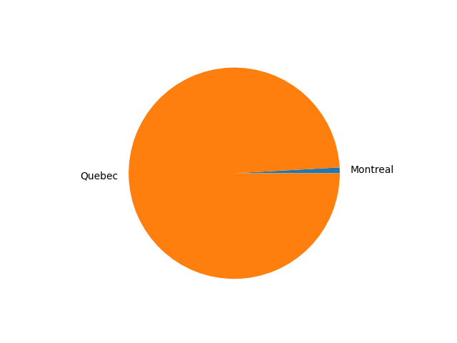

# Part 4 Reflection

Edward Adam Payzant, 
SN: 101082175

## The Work

**Note:** A more comprehensive but informal discription of my work can be found in the log.md

For this project, I decided to analyze Canadians enlisting in the American Civil War.
I specifically desired to seek out whether it was more of an urban trend or a rural trend.
My speculation was it would tend towards rural areas, specifically Nova Scotia and New Brunswick.
While my initial goal was to compare this with Canadian census data to get an enlistees per capita, but many technical difficulties prevented this.
Additionally, without the census records it was more difficult to define what was rural and urban Canada.

I collected the data from [Ancestry's Civil War Records](https://www.ancestry.com/search/categories/war_civil/).
I developed my own webscraper, heavily inspired by [Michael Herman's Ancestry webscraper](https://github.com/mjhea0/ancestry-scraper).

Lets first take a look at the enlistees per province.
When I generated this chart, I was not expecting Nova Scotia and New Brunswick to be such a large majority of the volunteers.
Additionally, I was very uncertain as to where Quebec would fall, as I predicted the rural population would not be very present but the Montreal population could make a major difference.
Finally, I was surpised how low Ontario was.

Lets take a look at the distribution per province now, and go through my process of analysis.

This is premised on Halifax being the only notable urban region in Nova Scotia, which naturally doesn't tell the whole story, but this chart still raises an interesting observation.
While there were other relatively densely populated areas, this still shows a very distinct trend towards rural Nova Scotians being the ones to enlist in the American Civil War. An additional observation was 25 men were noted to be specifically from Cape Breton, a fairly sparsely populated region of Nova Scotia.

This one was the most surprising to me. 
While I did consider Quebec's enlistees, I expected it to be mostly restricted to Montreal, as I doubted the rural French population would want to be involved in the war.
Instead, it appears to be predominantly a rural occurance.
This seemed odd, but I felt I could justify this observation as the appeal of a guranteed pension would be very enticing to farmers in rougher areas.

Finishing on looking at Ontario, this is what made me realize much of the analysis above was flawed as it was based on a flawed premise.
While Toronto and Ottawa did not have the relative size, they were still urban areas and their such small enlistment amount made me rethink the data.

To look onto the flaws of this analysis, I first need to explain an issue with the data.
Many entries only have a province listed, without a city or town listed.
I noticed this early on, and sampled a few men to further look into and found the majority to be from areas to small to note.
This made me feel safe to assume that was the case for a large enough amount to treat all of those entries like that.
Looking at the skew of this data, this was likely a very flawed assumption.
This will require more personalized analysis of the data set before any proper conclusions can be made.

## What I learned

While this project was a great learning experience for my technical abilities, notably I learned a lot about web scraping, the focus ended up being heavily on data cleaning and how messy data can be.
Cleaning the data was a great ordeal, as many US towns shared names with Canadian provinces and were very hard to filter out.
More critically was my false assumption about the missing data.
I feel this really demonstrates how important it is to consider gaps in the data or reassess assumptions about how the data is formatted.
